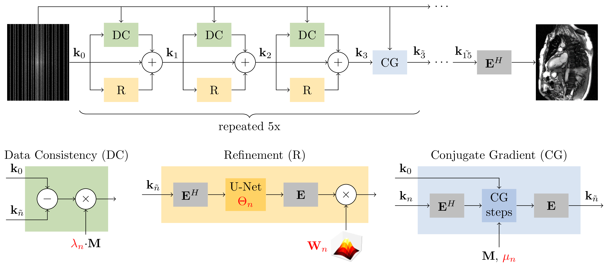

# CineVN

## Publication
Please cite the [original publication](https://onlinelibrary.wiley.com/doi/full/10.1002/mrm.30260) as follows:

> Vornehm M, Wetzl J, Giese D, et al. CineVN: Variational network reconstruction for rapid functional cardiac cine MRI. *Magn Reson Med.* 2025; 93(1): 138-150. doi: 10.1002/mrm.30260

## Overview
CineVN is a Variational Network-based method for reconstructing highly undersampled cardiac cine MRI.
It is trained and evaluted using the publicly available [OCMR dataset](https://www.ocmr.info/).
The source code is originally based on the [fastMRI repository](https://github.com/facebookresearch/fastMRI).

The code can be run in two ways:
- Training and testing networks by retrospectively undersampling fully-sampled data from the OCMR dataset. This requires following the [setup](#setup), [data preprocessing](#data-preprocessing), [training](#training), [testing](#testing), and [evaluation](#evaluation) instructions.
- Reconstruction of (prospectively undersampled) data in the MRD format. This requires following the [setup](#setup) and [inference](#inference) instructions.

## Setup
1. Create a python environment based on Python 3.10.
2. Install requirements: `pip install -r requirements.txt`
3. Install CineVN: `pip install -e .`

CUDA 11.8 is required. Newer CUDA versions will not work with the CuPy and PyTorch versions specified in the `requirements.txt` and `requirements_core.txt` files.

## Data preprocessing
Training and testing on the OCMR dataset[^1] requires preprocessing of the data. This includes the following steps:
* Reading the data
* Applying phase padding in k-space depending on acquisition parameters
* Filling asymmetric echo using the POCS method
* Cropping readout oversampling
* Retrospective undersampling
* Coil sensitivity map estimation on time-averaged k-space using ESPIRiT
* Generating reference reconstructions:
  * Sensitivity-weighted coil combination of fully-sampled k-space and
  * Compressed sensing reconstruction of undersampled k-space using temporal total variation regularization
* Splitting the data into training, validation, and test sets
* Saving the undersampled data and reference reconstructions in a new data format

To preprocess the data, run the following command with parameters in `< >` replaced according to your needs:

`python run_preprocessing.py ocmr <raw_dir> <target_dir> <coil_sens_dir> --cs_dir <cs_dir> --csv_query smp=='fs' --accelerations <acceleration_rates> --mask_types gro`

**Explanation of parameters:**
* `ocmr`: This is required and specifies that the OCMR dataset should be processed.
* `<raw_dir>`: The unprocessed OCMR datasets will be downloaded and saved in `<raw_dir>/ocmr`. You can avoid downloading the datasets during preprocessing if you download the OCMR dataset manually and save the h5 files in this directory.
* `<target_dir>`: The processed datasets will be saved below this directory, specifically in the following folders:
  * `<target_dir>/ocmr_train`: The training dataset. Each file contains the MRD header, fully-sampled k-space, and reference reconstructions.
  * `<target_dir>/ocmr_val`: The validation dataset. Each file contains the MRD header, fully-sampled k-space, and reference reconstructions.
  * `<target_dir>/ocmr_test_<masktype>_<acceleration>`: The test datasets, where a test set is created for each combination of undersampling mask types and acceleration rates as specified by the corresponding parameters below. Each file contains the MRD header, undersampled k-space, undersampling mask, and reference reconstructions.
* `<coil_sens_dir>`: Coil sensitivity maps will be saved below `<coil_sens_dir>/ocmr`
* `--cs_dir <cs_dir>`: Reference compressed sensing reconstructions will be saved in `<cs_dir>/ocmr_<masktype>_<acceleration>` with a separate folder for each combination of undersampling mask types and acceleration rates as specified by the corresponding parameters. Note that BART[^2] needs to be installed on your system. If this is not the case, you can skip the CS reconstructions by omitting this parameter.
* `--csv_query smp=='fs'`. This parameter specifies that only the fully-sampled OCMR datasets should be processed.
* `--accelerations <acceleration_rates>`: This defines the acceleration rates for which CS reconstructions and test sets should be generated. Multiple acceleration rates can be specified, for example, as `--accelerations 8 12 16 20`.
* `--mask_types gro`. This specifies that the GRO[^3][^4] sampling pattern should be used to generate CS reconstructions and test sets. Note that other sampling patterns are implemented, but not tested in the publication.
* Check `run_preprocessing.py` for additional options.

## Training
First, create a file named `cinevn_dirs.yaml` following the example file `cinevn_dirs_template.yaml` and specify the following paths:
* `data_path`: Should be the same as the `target_dir` specified during preprocessing.
* `coil_sens_path`: Should be the same as the `coil_sens_dir` specified during preprocessing.
* `log_path`: Directory in which training logs, checkpoints, and predicted reconstructions will be saved.
* `cache_path`: A cache file with information about the processed datasets will be saved in this directory. Note that if a dataset changes, the cache file should be deleted manually. Caching can be deactivated by adding `--data.use_dataset_cache_file False` to the training command (see below).

Run the following command for training:

`python run_CineVN.py fit -c configs/cine.yaml --name <experiment_name> --transform.accelerations <acceleration_rates> --data.num_workers <num_workers>`

**Explanation of parameters:**
* `-c configs/cine.yaml`: Specifies the config file, which defines most parameters.
* `--name <experiment_name>`: An identifier for the trained network. This name will be used to create a subdirectory in your `log_path`.
* `--transform.accelerations <acceleration_rates>`: Defines the acceleration rate(s) for which the network should be trained. Fully sampled training data is retrospectively undersampled during training using this acceleration rate. Multiple acceleration rates can be specified, for example, as `--transform.accelerations 6 7 8 9 10`.
* `--data.num_workers <num_workers>`: Number of workers for data loading. Adjust this according to your system. Default is 32.
* See `configs/cine.yaml` for more options. All options can be changed either in this file or can be overwritten by passing the corresponding option as a command line argument.

## Testing
Create a `cinevn_dirs.yaml` file as explained above in the [Training](#training) section.

Run the following command for testing:

`python run_CineVN.py test -c configs/cine.yaml --name <experiment_name> --data.test_split <masktype>_<acceleration> --callback.save_gif [True|False]`

**Explanation of parameters:**
* `-c configs/cine.yaml`: Specifies the config file, which defines most parameters.
* `--name <experiment_name>`: Should be the same as during training.
* `--data.test_split <masktype>_<acceleration>`: Specifies the name of the test set. This is composed of the mask type and the acceleration rate (e.g. `gro_08`). See your `<target_dir>` specified during preprocessing for the names of the available test sets. Note that the names of the directories containing your test sets will start with `ocmr_test_`, but this should be omitted in this command line argument.
* `--callback.save_gif [True|False]`: Save the reconstructions additionally as GIF and APNG files. Default is False.
* See `configs/cine.yaml` for more options.
* Make sure to match model parameters with those used during training.

Reconstructions will be saved as h5 files in a `reconstructions` folder in the corresponding folder in your `log_path`.

## Evaluation
The reconstructions can be converted and evaluated using the following command:

`python evaluation/evaluate_retrospective.py <experiment_name> <test_set> <logs_dir> --gt_dir <gt_dir> --cs_dir <cs_dir>`

This script will:
* save CineVN, reference fully-sampled, and reference compressed sensing reconstructions as GIF, TIFF, and DICOM files
* save spatiotemporal profiles for each reconstruction
* save error images for each reconstruction (note that pixel values are scaled by a factor of 20 in the error images)
* compute image quality metrics for each reconstruction

All outputs will be saved in a folder `<logs_dir>/<experiment_name>/evaluations/<test_set>`.

**Explanation of parameters:**
* `<experiment_name>`: Should be the same as during training and testing.
* `<test_set>`: Name of the test set that was reconstructed. Should be in the form `ocmr_test_<masktype>_<acceleration>`. See the `reconstructions` folder in your experiment's log directory for the correct name.
* `<logs_dir>`. Path to your `log_path`. Note that this is not automatically read from your `cinevn_dirs.yaml` file.
* `--gt_dir <gt_dir>`: Path to the preprocessed data. Should be the same directory that was given as `<target_dir>` during preprocessing. The fully-sampled reference reconstructions will be read from this location. Omit this option to skip computing quantitative image metrics.
* `--cs_dir <cs_dir>`: Path to the compressed sensing reconstructions. Should be the same directory as during preprocessing. Omit this option to skip comparison with compressed sensing.

## Inference
Use the following command to reconstruct undersampled Cartesian cardiac cine data in the MRD format, for example cines from the OCMR dataset starting with `us...`. Reconstructions will be saved as NPY and GIF files.

`python run_inference_mrd.py <mrd_dataset> <model> --out_folder <out_folder>`

**Explanation of parameters:**
- `<mrd_dataset>`: Path to the MRD dataset as h5 file.
- `<model>`: Path to the model to use for reconstruction. This can be one of the [pretrained models](#pretrained-models) described below or a model trained using the instructions above.
- `--out_folder <out_folder>`: Path to the target directory where the reconstructions should be saved. If omitted, reconstructions will be saved in the same directory as `<mrd_dataset>`.

## Pretrained models
Checkpoints for pretrained models with the GRO sampling pattern and acceleration rates R={8,12,16,20} are included in the [models](models) directory of this repository.

---

[^1]: https://www.ocmr.info/
[^2]: https://mrirecon.github.io/bart/
[^3]: https://github.com/OSU-CMR/cmr-sampling
[^4]: https://arxiv.org/abs/2206.03630
